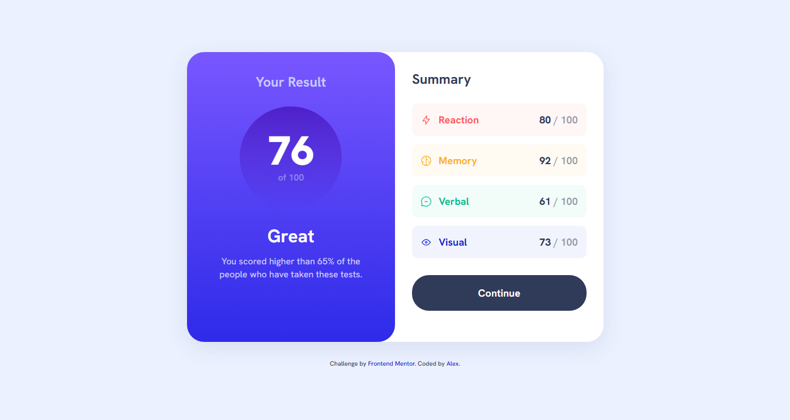
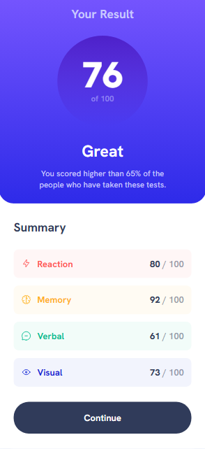

## Índice

- [Visão Geral](#visão-geral)
  - [O Desafio](#o-desafio)
  - [Screenshot](#screenshot)
- [Tecnologias utilizadas](#tecnologias-utilizadas)
- [Funcionalidades](#Funcionalidades)
- [Como Executar o Projeto](#como-executar-o-projeto)
- [Desafio e Aprendizado](#desafio-e-aprendizado)
- [Autor](#autor)
- [Agradecimentos](#agradecimentos)


## Visão Geral

Este projeto é uma solução para o desafio "Results summary component" do Frontend Mentor. O objetivo foi construir um componente de sumário de resultados visualmente atraente e responsivo, seguindo o design fornecido.

### O Desafio

O desafio consistiu em construir o componente para que ele:
- Exiba o layout ideal para os tamanhos de tela desktop e mobile.
- Permita que as cores de base e gradientes sejam facilmente configuradas usando variáveis CSS.
- Inclua elementos interativos, como um botão "Continue".

### Screenshot

* **Desktop Design:**

    
* **Mobile Design:**

    

## Tecnologias Utilizadas

* **HTML5:** Estrutura semântica do componente.
* **CSS3:** Estilização, incluindo:
    * **Variáveis CSS (Custom Properties):** Para gerenciamento de cores e gradientes.
    * **Flexbox:** Para layout e alinhamento dos elementos.
    * **Media Queries:** Para responsividade em diferentes tamanhos de tela.
    * **Fontes Personalizadas:** Utilizando 'Hanken Grotesk' via `@font-face`.
* **Reset CSS:** Para garantir consistência de estilo entre navegadores.

## Funcionalidades

* Exibição de pontuação geral e individual por categoria.
* Design visualmente fiel ao desafio do Frontend Mentor.
* Componente responsivo, adaptando-se a diferentes tamanhos de tela.
* Botão interativo com efeito hover.

## Como Executar o Projeto

Siga estas etapas para configurar e executar o projeto localmente:

1.  **Clone o repositório (se estiver em um):**
    ```bash
    git clone URLhttps://github.com/alex-coder27/results-summary-component-main.git
    ```
2.  **Navegue até a pasta do projeto:**
    ```bash
    cd results-summary-component-main
    ```
3.  **Abra o arquivo `index.html` no seu navegador:**
    Você pode simplesmente arrastar o `index.html` para a janela do seu navegador ou usar uma extensão de "Live Server" em seu editor de código (como o VS Code) para uma melhor experiência de desenvolvimento.

## Desafio e Aprendizado

Este projeto foi uma excelente oportunidade para aprimorar minhas habilidades em:
* Organização de CSS com variáveis e estruturação de arquivos.
* Construção de layouts responsivos utilizando Flexbox.
* Detalhes finos de design, como cores grandientes e arredondamento de bordas para replicar um design pixel-perfect.

## 👤 Autor

- **GitHub:** [alex-coder27](https://github.com/alex-coder27)

## 🙏 Agradecimentos

- Ao [Frontend Mentor](https://www.frontendmentor.io) pelo desafio que me ajudou a praticar e aprimorar minhas habilidades em desenvolvimento web front-end.
